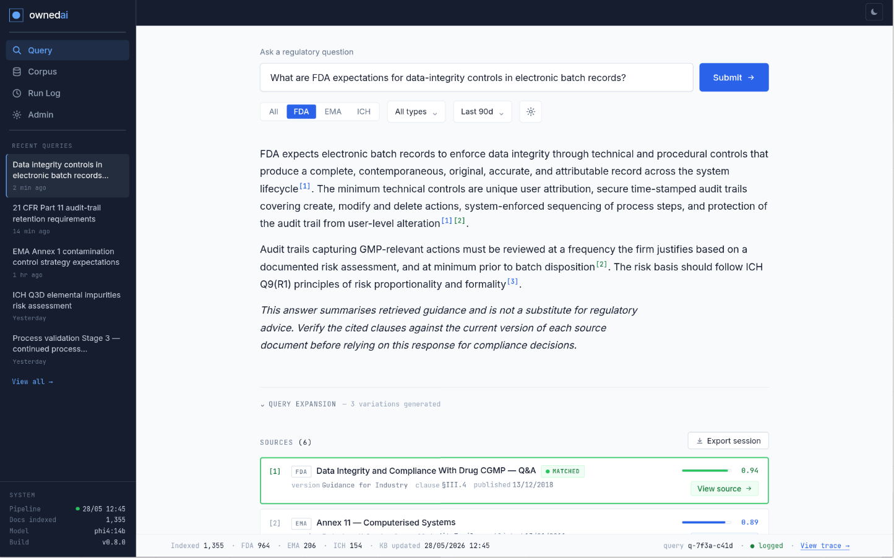
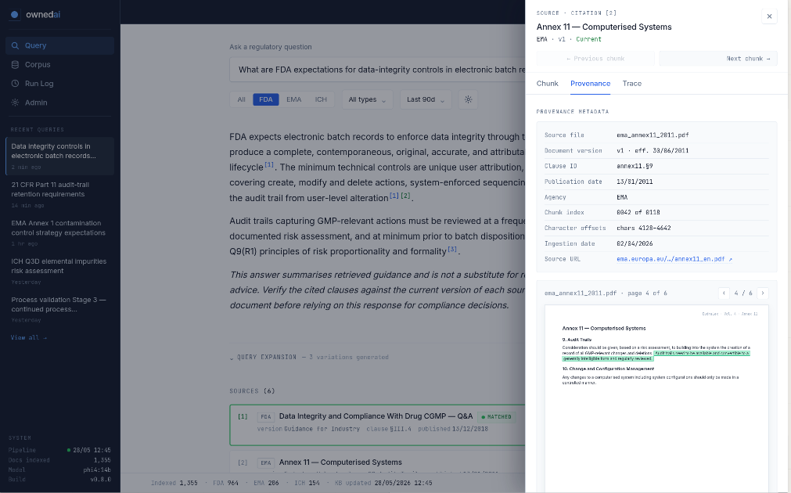
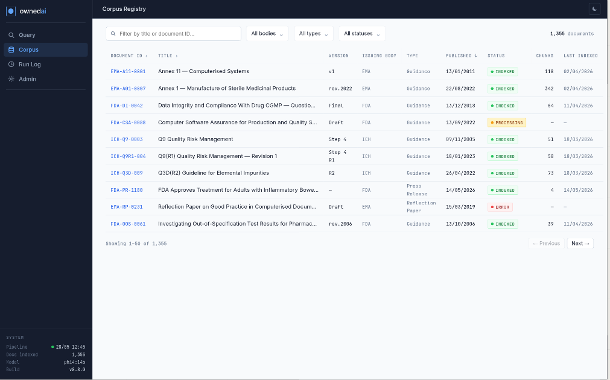
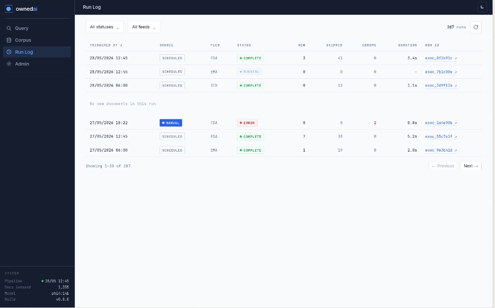

# OwnedPulse

Sovereign regulatory intelligence for pharmaceutical and life sciences teams.

OwnedPulse is a private, on-premises RAG (Retrieval-Augmented Generation) system over public regulatory documents from EMA, FDA and ICH. Queries, retrieved content and generated answers stay on your infrastructure. The system itself downloads public regulatory documents from the issuing agencies' websites.



> **Demonstrator.** OwnedPulse is a portfolio and operational demonstration system. It is not a validated GxP system. See [Intended use boundary](#intended-use-boundary) and [Security and runtime model](#security-and-runtime-model) before installing.

---

## What it does

OwnedPulse answers regulatory questions by retrieving and synthesising content from a curated corpus of public guidance documents. Each answer lists the source chunks it was built from, with document version, clause and ingestion metadata.

Typical queries:

- Compare Annex 11 and 21 CFR Part 11 requirements for audit trails
- What does ICH Q9(R1) say about risk acceptability criteria?
- Summarise recent EMA press releases on GMP enforcement

---

## Demo

[Watch on YouTube](https://youtu.be/b8GvY9ZtY5Y)

Recorded on v1.0.14. The UI, corpus handling and retrieval have changed since the recording.

### Screenshots

Screenshots are from a development build (the sidebar shows an older build number).

| Provenance of a retrieved chunk | Corpus registry | Ingestion run log |
|---|---|---|
|  |  |  |

---

## Who it is for

Regulatory Affairs and QA professionals who need fast, sourced answers across multiple regulatory frameworks, without sending documents or questions to a cloud service.

The target deployment context is organisations operating under GxP obligations (EU GMP, FDA cGMP, ICH guidelines) where data sovereignty is a compliance requirement, not a preference.

---

## Intended use boundary

**OwnedPulse is not a GxP Document Management System.** It does not replace Documentum, Veeva Vault or equivalent validated DMS platforms.

The corpus contains public regulatory documents only. OwnedPulse does not process internal SOPs, deviations, batch records or any organisation-specific GxP records.

**Outputs require human review before use in any GxP decision.** The system is advisory. It does not make autonomous decisions in regulated processes.

**OwnedPulse has not been validated** under GAMP 5 / CSA methodology. Organisations deploying it in a GxP context are responsible for their own validation and qualification activities.

Author's preliminary view, not a formal assessment: as configured here, OwnedPulse would likely be treated as GAMP 5 Category 5 (custom software) with an advisory function. The deploying organisation must perform its own categorisation and risk assessment.

---

## Security and runtime model

Read this before installing.

- **No authentication.** The OwnedPulse API and UI have no login. Anyone who can reach them can query the system and use the admin functions.
- **Services listen on all interfaces.** PostgreSQL, Qdrant, Ollama, Docling and Langfuse ports are published on the host. Qdrant and Ollama have no authentication of their own.
- **Runtime.** The API runs without auto-reload by default. Editing files under `api/` restarts the API and interrupts a running ingestion only when `UVICORN_RELOAD=true`, which is for development. The UI runs under the Vite development server. Both services have their source directories bind-mounted into the containers.

Run OwnedPulse on a single workstation or an isolated, trusted network only. Do not expose it to the internet. Change every `change_me` value in `.env` before the first start. See [SECURITY.md](SECURITY.md).

---

## Corpus

Public regulatory documents from:

- **EMA**: scientific guidelines, regulatory guidance
- **FDA**: guidance documents (full catalogue), press releases
- **ICH**: guidelines via the ICH JSON API

The base corpus (12 documents, always included) is defined in [`config/corpus_manifest.json`](config/corpus_manifest.json):

- EU GMP Annex 11: Computerised Systems
- EU GMP Annex 15: Qualification and Validation
- EU GMP Annex 22: Artificial Intelligence (**draft**, public consultation version)
- 21 CFR Part 11: Electronic Records; Electronic Signatures
- FDA Part 11, Electronic Records; Electronic Signatures: Scope and Application
- FDA Computerized Systems Used in Clinical Investigations
- FDA Computer Software Assurance for Production and Quality System Software
- FDA Data Integrity and Compliance with CGMP: Questions and Answers
- ICH Q9: Quality Risk Management (2005)
- ICH Q9(R1): Quality Risk Management
- ICH Q10: Pharmaceutical Quality System
- EMA Reflection Paper on the Use of Artificial Intelligence in the Medicinal Product Lifecycle

Extending the corpus beyond the declared scope is a change control event.

---

## Architecture

```
Fetch (Python scrapers) → Chunk (Docling) → Embed (Ollama) → Store (Qdrant)
                                                                   ↓
                                           Query API (FastAPI) ← Retrieve
                                                   ↓
                                       Generate (Ollama / phi4)
                                                   ↓
                                      Response + provenance metadata
```

| Component | Technology |
|-----------|------------|
| API | FastAPI |
| UI | React + Vite + Tailwind |
| Vector store | Qdrant |
| Database | PostgreSQL |
| Generation model | phi4:14b-q8_0 via Ollama |
| Embedding model | mxbai-embed-large (1024-dim, cosine) |
| Observability | Langfuse |
| PDF parsing | Docling (GPU by default, CPU optional) |
| Deployment | Docker Compose |

**Reproducible retrieval by design.** Query expansion runs at temperature 0.0 and every chunk has a deterministic ID: MD5(doc_id | version | chunk_index | chunker_version) → UUID, so IDs change when the chunker version changes. Repeated runs on the reference installation returned the same sources. Results can differ across model versions, hardware or index rebuilds.

**Observability.** Query traces are captured in Langfuse, including sub-queries, retrieved chunk IDs, similarity scores and the prompt template version used.

---

## Requirements

| | |
|---|---|
| OS | Linux with Docker Engine and Docker Compose v2 (2.24 or newer for the CPU Docling option) |
| GPU | NVIDIA GPU, 24 GB VRAM recommended (phi4:14b-q8_0 plus GPU Docling), with nvidia-container-toolkit |
| NVIDIA driver | Must support CUDA 12.8 for the default GPU Docling image |
| Disk | 60 GB free recommended before ingestion: GPU Docling image ~17 GB on disk (CPU image ~15 GB), phi4:14b-q8_0 ~15 GB, mxbai-embed-large ~0.7 GB, OwnedPulse images ~1.3 GB, plus PostgreSQL, Qdrant and Langfuse images. The full EMA/FDA/ICH feeds add tens of GB of archived documents. |
| Network | Internet access during installation (images, models, Python and npm packages, a Hugging Face tokenizer) and for corpus downloads and scheduled feed runs |

Reference system (author's setup): Debian 13, AMD Ryzen 7 5700X, 64 GB RAM, NVIDIA RTX 3090 24 GB.

First installation downloads roughly 25 GB. Expect it to take from about 30 minutes to well over an hour depending on bandwidth (estimate).

---

## Quick start

```bash
git clone https://github.com/ownedai/ownedpulse.git
cd ownedpulse
cp .env.example .env
```

Edit `.env` and set at least:

| Variable | Value |
|---|---|
| `POSTGRES_PASSWORD` | strong password |
| `LANGFUSE_DB_PASSWORD` | strong password |
| `LANGFUSE_NEXTAUTH_SECRET` | output of `openssl rand -hex 32` |
| `LANGFUSE_SALT` | output of `openssl rand -hex 16` |
| `LANGFUSE_INIT_USER_EMAIL` | your Langfuse admin login |
| `LANGFUSE_INIT_USER_PASSWORD` | strong password |

Leave `LANGFUSE_PUBLIC_KEY` and `LANGFUSE_SECRET_KEY` empty: `install.sh` generates them.

```bash
./install.sh
```

`install.sh` checks prerequisites, starts PostgreSQL, Qdrant, Ollama, Docling and Langfuse, applies database migrations, pulls the Ollama models, then builds and starts the API and UI. It is safe to re-run.

### After installation

1. Open the UI at http://localhost:5173 (or `UI_PORT`).
2. Use **Initial Load** to download and ingest the corpus.
3. Optional: log into Langfuse at http://localhost:3001 (or `LANGFUSE_HOST_PORT`) with the admin email and password from `.env`.

---

## Configuration

All settings live in `.env`; see the comments in [`.env.example`](.env.example).

| Setting | Purpose |
|---|---|
| `*_HOST_PORT`, `API_PORT`, `UI_PORT` | Host ports. Change these if a port is already in use; container-internal ports are fixed. |
| `*_MODE=external` | Use an existing PostgreSQL, Qdrant, Ollama, Docling or Langfuse instead of the bundled container. Set the matching `*_HOST`, `*_PORT` and credentials. |
| `DOCLING_VARIANT=cpu` | Run Docling on the CPU instead of the GPU. Usable and fully supported; PDF parsing during ingestion is slower, and VRAM is left free for the generation model. |
| `OLLAMA_GEN_MODEL` | Generation model (default `phi4:14b-q8_0`). |
| `UVICORN_RELOAD` | `true` restarts the API when a file under `api/` changes, for development. Off by default: a reload interrupts a running ingestion. |
| `VITE_ALLOWED_HOSTS` | Comma-separated hostnames allowed to reach the UI, e.g. when opening it by server name instead of `localhost` or an IP address. |
| `HF_TOKEN` | Optional Hugging Face token. |
| `RSS_SCHEDULE_*` | Time of the daily feed run. |

---

## Operations

| Task | Command |
|---|---|
| Stop OwnedPulse API and UI | `./install.sh --stop` |
| Start or update after changes | `./install.sh` (add `--no-build` to skip image builds) |
| Update to a new release | wait until no ingestion is running, then `git pull && ./install.sh` |
| Stop everything | `docker compose --profile postgres --profile qdrant --profile ollama --profile docling --profile langfuse down` |
| Remove everything, including all data | the command above with `-v`, then delete `./data` |
| Reset the corpus and re-ingest from scratch | see **Resetting the corpus** below |

With `DOCLING_VARIANT=cpu`, add `-f docker-compose.yml -f docker-compose.docling-cpu.yml` to manual `docker compose` commands. `down -v` deletes the database, vector store and downloaded models permanently.

Maintenance scripts are documented in [`scripts/maintenance/README.md`](scripts/maintenance/README.md).

### Resetting the corpus

Resetting empties the vector store and the run history and re-registers the base corpus from archive metadata, while the downloaded documents stay on disk with their registry rows intact. The next Initial Load then re-ingests everything, rewriting chunk payloads and registry dates — which is what makes it the way to recover from ingestion-side defects in an earlier release.

```bash
curl -X POST http://localhost:8001/api/admin/reset-corpus \
     -H 'Content-Type: application/json' -d '{"confirm": true}'
```

Then run **Initial Load** from the UI, or:

```bash
curl -X POST http://localhost:8001/api/bootstrap/run \
     -H 'Content-Type: application/json' -d '{}'
```

The reset truncates `ingestion_doc`, `ingestion_state` and `run_log`, deletes and recreates the Qdrant collection, and re-registers the base corpus. `document_registry` is kept, not cleared: the manifest's twelve documents are upserted onto the rows already present, so every downloaded document keeps its registry row, its ingest status and its publication date. The response reports both counts — `registry_rows_kept` and `base_corpus_seeded`. It refuses with HTTP 409 while an ingestion is running, so wait for any run to finish first. Nothing is skipped afterwards: a document is only skipped when its registry status is `success`/`indexed` **and** Qdrant still holds its vectors, so an empty collection forces a full re-ingest.

There is no UI button and no `install.sh` flag for this; it is an API call by design, because it is destructive. To keep the downloaded documents, do **not** use the `down -v` row above — that also deletes `./data`.

---

## Troubleshooting

| Symptom | Check |
|---|---|
| `No NVIDIA GPU detected` or GPU containers fail | `nvidia-smi` on the host; install nvidia-container-toolkit and restart Docker. Or use `DOCLING_VARIANT=cpu`. |
| Port already in use | Change the matching `*_HOST_PORT`, `API_PORT` or `UI_PORT` in `.env`, then re-run `./install.sh`. |
| UI shows "Blocked request. This host is not allowed" | Add the hostname to `VITE_ALLOWED_HOSTS`. |
| First query after start is very slow | The generation model is loaded from disk into GPU memory — about 15 GB — and that load is charged to whichever request triggers it. The API starts loading it in the background at startup and `install.sh` waits for it, so a slow *first* query usually means the model was evicted between start and your query. On a shared GPU another model can evict it and the next query pays the load again. |
| Query shows a timeout error, or takes minutes | A generation model that has been evicted from GPU memory is reloaded on the next request, and a 17 GB reload inside a request is slow. Run `docker logs ollama \| grep evicting` — repeated "model predicted to exceed available memory" lines mean the GPU is short of room; free memory or move other work off it. On a **shared** Ollama, every client must use the same context size for the same model: Ollama keeps one runner per (model, `num_ctx`), so a second size evicts the first. OwnedPulse's own value is `OLLAMA_NUM_CTX` and must match what other clients request. Raise `OLLAMA_TIMEOUT` (default 180s) if generation legitimately takes longer. |
| Docling fails with `CUDA out of memory` | Ingestion parses PDFs on the GPU. Free GPU memory, or set `DOCLING_VARIANT=cpu` to move parsing to the CPU (slower, but leaves the GPU to the generation model). |
| Langfuse did not become healthy | First start runs migrations and can be slow. Re-run `./install.sh`. |
| Base corpus missing after install | `docker logs ownedpulse-api 2>&1 \| grep seed_registry` |
| `WARNING: char_offset` lines after ingestion | Offset anchor matching failed for some chunks. They are still ingested and searchable. Query the `chunks` table for rows where `char_offset_end - char_offset_start < 50` for the affected `document_id`, fix the source text formatting, then re-ingest that document. |

---

## Evaluation

A structured evaluation used 50 questions in three categories, designed to reflect real regulatory work tasks rather than system testing scenarios. All numbers below are reproduced from the published result files by [`eval/summarise.py`](eval/summarise.py); see [`eval/README.md`](eval/README.md). Reference hardware: NVIDIA RTX 3090 24 GB (author's statement).

**Question categories**

- A (15 questions): core lookup, single document, specific requirement
- B (25 questions): cross-framework synthesis across regulatory bodies
- C (10 questions): boundary and scope, correct behaviour at corpus edges

Answers were scored 0–3 per question by three judge models (Claude Sonnet 4.6, GPT-4.1, DeepSeek V4 Pro) against a defined rubric. Clause citation was not required unless explicitly asked. Correct declination of out-of-scope questions scores 3. Judging used hosted APIs; only public-corpus questions, retrieved public text and generated answers were sent.

**Results with phi4:14b-q8_0 as generation model**

| Judge | Overall | Cat A | Cat B | Cat C |
|---|---|---|---|---|
| Claude Sonnet 4.6 | 71.3% | 88.9% | 61.3% | 70.0% |
| GPT-4.1 | 75.3% | 88.9% | 68.0% | 73.3% |
| DeepSeek V4 Pro¹ | 61.9% | 82.2% | 45.3% | 74.1% |
| **Mean of 3 judges** | **69.5%** | **86.7%** | **58.2%** | **72.5%** |

The mean of Claude and GPT-4.1 alone is 73.3% overall. DeepSeek gave the lowest scores, with the largest gap in Category B.

¹ DeepSeek returned a usable score for 49 of 50 questions here (48 of 50 for Qwen2.5-72B below); its percentages use that denominator. All other figures use 50.

**Generation model comparison: same retrieved context, different models**

The retrieval output was held constant: each generation model received the identical retrieved chunks per question, isolating generation quality from retrieval quality.

| Generation model | Mean of 3 judges | Cat B |
|---|---|---|
| phi4:14b-q8_0 (local, reference hardware) | 69.5% | 58.2% |
| Llama 4 Scout (open-weight) | 65.5% | 62.7% |
| Qwen2.5-72B (open-weight) | 68.3% | 61.9% |
| GPT-OSS-20B (open-weight, Apache 2.0) | 66.7% | 60.0% |
| GPT-OSS-120B (open-weight, Apache 2.0) | **76.2%** | **76.4%** |
| Claude Sonnet 4.6 (hosted API) | **87.7%** | **85.5%** |

Answers for the comparison models were generated through hosted APIs from the frozen retrieved context; the scripts used to generate them are not part of this repository. The result files are.

**What this means for deployment**

The architecture is model-agnostic and answer quality scales with the generation model. On a single consumer GPU, the system scores 69.5%. GPT-OSS-120B, an Apache 2.0 open-weight model deployable entirely on-premises with more GPU memory, scores 76.2%. Claude Sonnet 4.6 via a hosted API scores 87.7% as a reference ceiling, but a hosted API does not keep queries on your infrastructure.

Category B (cross-framework synthesis) shows the largest model-dependent spread, from 58% to 85%. It is the most valuable query type and the area where more capable hardware returns measurable quality gains.

All open-weight models in the comparison can run on private infrastructure under permissive licences.

---

## Traceability design

Each query response surfaces:

- Chunk ID, document ID, document version, clause ID
- Similarity score per retrieved chunk
- Prompt template version (hash)
- Embedding model and chunker version
- Ingestion timestamp and source hash
- Supersede status of the source document

This metadata is designed to support a validation package for organisations deploying under EU GMP Annex 11 or 21 CFR Part 11. Langfuse traces provide a query trace log for observability. They are **not** a validated, tamper-evident audit trail in the sense of Annex 11 or Part 11.

---

## Tests

The test suite in `tests/` runs against a live installation (API on port 8001):

```bash
pip install -r tests/requirements-test.txt
bash tests/run_tests.sh fast    # API + compliance checks, no LLM calls
bash tests/run_tests.sh         # all suites
```

---

## Status

v1.1.0, October 2026. Maintained as a portfolio demonstrator; updates are occasional. See [CHANGELOG.md](CHANGELOG.md).

## Contributing and security

See [CONTRIBUTING.md](CONTRIBUTING.md) and [SECURITY.md](SECURITY.md).

## License

Apache License 2.0. See [LICENSE](LICENSE) and [NOTICE](NOTICE).

## About

Built by [ownedai](https://ownedai.dev): private AI infrastructure for regulated industries.
